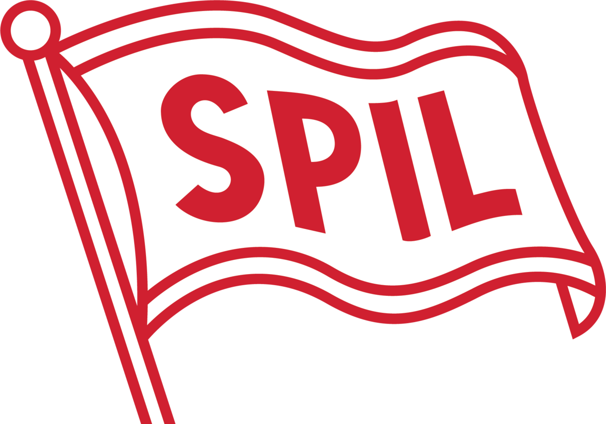

# HVE Electrical SPIL - Field Work Report System

<div align="center">
  
  
  ### Heavy Equipment Electrical PT. Salam Pasific Indonesia Lines
  
  A modern, professional field work management system

  [](https://reactjs.org/)
  [](https://vitejs.dev/)
  [](https://tailwindcss.com/)
</div>

---

## 🌟 Features

### 📊 **Dashboard Analytics**
- Real-time statistics and performance metrics
- Visual data representation with charts
- Quick overview of all activities
- Responsive design for all devices

### 📝 **Report Management**
- Create, edit, and delete field reports
- Comprehensive report forms with validation
- Rich text descriptions and notes
- Time tracking (start/end time)
- Location and project details
- Professional modal-based forms

### ✅ **Task Management**
- Create and track tasks with priorities (Low/Medium/High)
- Progress tracking system with percentage
- Progress log history with timestamps
- Deadline management
- Status indicators (To Do/In Progress/Completed)
- Detailed task descriptions

### 🔧 **Sparepart Ordering**
- Order new spareparts with quantity tracking
- Status tracking (Pending/Ordered/Arrived)
- Order and arrival date management
- Unit and description fields
- Easy-to-use modal interface

### 🎨 **Modern UI/UX**
- Professional animations and transitions
- Smooth modal interactions with dark backdrop
- Per-letter hover animations on title
- Card hover effects with lift animation
- Custom scrollbar styling
- Glass morphism effects
- Responsive mobile-first design

### 🌐 **Bilingual Support**
- Indonesian (ID) and English (EN) languages
- Real-time language switching
- Complete translation coverage (200+ keys)
- Persistent language preference

### 🎭 **Theme System**
- Light, Dark, and Auto modes
- System preference detection
- Smooth theme transitions
- Persistent theme preference
- Optimized for readability

### 🔄 **Real-time Synchronization**
- Google Sheets as backend database
- Automatic data synchronization
- Multi-user collaboration support
- Instant updates across all clients

### 🧭 **Browser Navigation**
- Full browser history integration
- Back/forward button support
- URL hash routing (#dashboard, #laporan, #tasks, #spareparts)
- Page refresh maintains current view

### 🔍 **Search & Filter**
- Real-time search functionality
- Filter by status and priority
- Quick access to specific entries
- Responsive search results

---

## 🚀 Getting Started

### Prerequisites

- Node.js (v16 or higher)
- npm or yarn package manager
- Modern web browser (Chrome, Firefox, Safari, Edge)

### Installation

1. **Clone the repository**
   ```bash
   git clone https://github.com/sahikjaman/laporan-pekerjaan.git
   cd laporan-pekerjaan
   ```

2. **Install dependencies**
   ```bash
   npm install
   ```

3. **Run development server**
   ```bash
   npm run dev
   ```

4. **Open in browser**
   ```
   http://localhost
   ```

### Build for Production

```bash
npm run build
```

The optimized production build will be in the `dist/` directory.

### Preview Production Build

```bash
npm run preview
```

---

## 🛠️ Technology Stack

- **Frontend Framework**: React 18.2.0
- **Build Tool**: Vite 5.0
- **Styling**: TailwindCSS 3.4 + Custom CSS animations
- **Icons**: Lucide React
- **Backend**: Google Sheets API (via Apps Script)
- **Routing**: Browser History API with URL hashing
- **State Management**: React Hooks (useState, useEffect)
- **Date Handling**: Native JavaScript Date API

---

## 🎨 Key Features Breakdown

### Animation System
- **15+ custom CSS animations** including fadeIn, slideIn, scaleIn, hover-lift
- **Modal animations** with backdrop fade and content slide
- **Per-letter hover effects** on title with scale and color transition
- **Card transitions** with smooth hover states
- **Custom scrollbar** with auto-hide functionality

### Form System
- **Professional modal-based forms** with dark backdrop (60% opacity)
- **Form validation** with required field checks
- **Auto-save functionality** with loading states
- **Cancel with browser back** button integration
- **Responsive layouts** adapting to screen sizes

### Data Management
- **Google Sheets backend** for easy data management
- **RESTful API structure** using Google Apps Script
- **Optimistic UI updates** for better user experience
- **Error handling** with user-friendly messages
- **Auto-refresh** capability with visual feedback

---

## 📱 Browser Support

- ✅ Chrome (latest)
- ✅ Firefox (latest)
- ✅ Safari (latest)
- ✅ Edge (latest)
- ✅ Mobile browsers (iOS Safari, Chrome Mobile)

---

## 🤝 Contributing

Contributions, issues, and feature requests are welcome!

1. Fork the project
2. Create your feature branch (`git checkout -b feature/AmazingFeature`)
3. Commit your changes (`git commit -m 'Add some AmazingFeature'`)
4. Push to the branch (`git push origin feature/AmazingFeature`)
5. Open a Pull Request

---

## 👨‍💻 Author

**Sahik Jaman**
- GitHub: [@sahikjaman](https://github.com/sahikjaman)

---

## 🙏 Acknowledgments

- HVE Electrical SPIL team for requirements and feedback
- React and Vite communities for excellent documentation
- TailwindCSS for the utility-first CSS framework
- Lucide for beautiful open-source icons

---

<div align="center">
  Made with ❤️ for HVE Electrical SPIL
  
  **Heavy Equipment Electrical PT. Salam Pasific Indonesia Lines**
</div>
